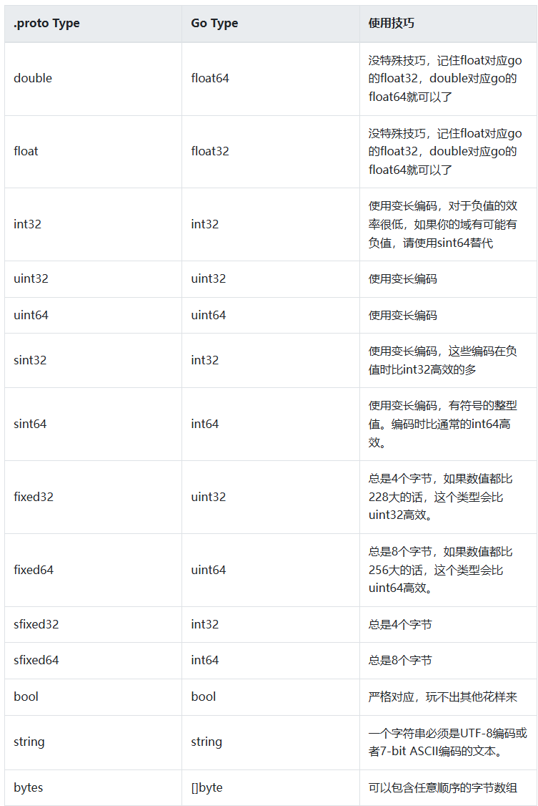

1. 下载protocol命令工具
https://github.com/protocolbuffers/protobuf/releases

2. 我们需要在 Golang 中使用 protobuf，还需要安装 protoc-gen-go，这个工具用来将 .proto 文件转换为 Golang 代码。
go get -u github.com/golang/protobuf/protoc-gen-go
3. 语法
   ProtoBuf支持多种数据类型，例如：string、int32、double、float等等

   
- 上面消息体中的 string query = 1; 这个1是什么呢？

这些数字是“分配表示号”：在消息定义中，每个字段后面都有一个唯一的数字，这个就是标识号。

这些标识号的作用是：用来在消息的二进制格式中识别各个字段的，一旦开始使用就不能够再改变。

注意：分配标识号在每个消息内唯一，不同的消息体是可以拥有相同的标识号的。

小技巧：[1,15]之内的标识号在编码的时候会占用一个字节。[16,2047]之内的标识号则占用2个字节。所以应该为那些频繁出现的消息元素保留 [1,15]之内的标识号。

```
message Test {
  reserved 2, 5, 7 to 10; // 保留2，5，7到10这些标识号
}
```
- 枚举类型
```
enum SexType //枚举消息类型，使用enum关键词定义,一个性别类型的枚举类型
{
    UNKONW = 0; //proto3版本中，首成员必须为0，成员不应有相同的值
    MALE = 1;  //1男
    FEMALE = 2; //2女  0未知
}

// 定义一个用户消息
message UserInfo
{
    string name = 1; // 姓名字段
    SexType sex = 2; // 性别字段，使用SexType枚举类型
}
```
- 我们在实际开发中，通常要定义很多消息，如果都写在一个proto文件，是不方便维护的。

小技巧：将消息定义写在不同的proto文件中，在需要的时候可以通过import导入其他proto文件定义的消息。

```protobuf
//创建文件: article.proto

syntax = "proto3";

package nesting;

option go_package = "./;article";

message Article {
  string          url   = 1;
  string          title = 2;
  repeated string tags  = 3; // 字符串数组类型
}
```
```protobuf
//创建文件: list_article.proto

syntax = "proto3";
// 导入Article消息定义
import "article.proto";

package nesting;

option go_package = "./;article";

// 定义ListArticle消息
message ListArticle {
  // 使用导入的Result消息
  repeated Article articles = 1;
}
```
- map语法
  ```map<key_type, value_type> map_field = N;```
  语法非常简单和通用，但是有几个问题需要我们注意：

   key_type可以是任何整数或字符串类型（除浮点类型和字节之外的任何标量类型）。
   注意：枚举不是有效的key_type。
   value_type 可以是除另一个映射之外的任何类型。
   Map 字段不能使用repeated关键字修饰。

   我们举个典型的例子：学生的学科和分数就适合用map定义：
```
syntax = "proto3";

package map;

option go_package = "./;score";

message Student{
int64              id    = 1; //id
string             name  = 2; //学生姓名
map<string, int32> score = 3;  //学科 分数的map
}
```

- 定义服务
如果消息类型是用来远程通信的(Remote Procedure Call, RPC)，可以在 .proto 文件中定义 RPC 服务接口。例如我们定义了一个名为 SearchService 的 RPC 服务，提供了 Search 接口，入参是 SearchRequest 类型，返回类型是 SearchResponse
```
service SearchService {
rpc Search (SearchRequest) returns (SearchResponse);
}
```

# 推荐风格
1. 文件(Files)
文件名使用小写下划线的命名风格，例如 lower_snake_case.proto
每行不超过 80 字符
使用 2 个空格缩进
2. 包(Packages)
包名应该和目录结构对应，例如文件在my/package/目录下，包名应为 my.package
消息和字段(Messages & Fields)

3. 消息名
使用首字母大写驼峰风格(CamelCase)，例如message StudentRequest { ... }
4. 字段名
使用小写下划线的风格，例如 string status_code = 1
5. 枚举类型
枚举名使用首字母大写驼峰风格，例如 enum FooBar，枚举值使用全大写下划线隔开的风格(CAPITALS_WITH_UNDERSCORES )，例如 FOO_DEFAULT=1
服务(Services)

6. RPC 服务名和方法名
均使用首字母大写驼峰风格，例如service FooService{ rpc GetSomething() }